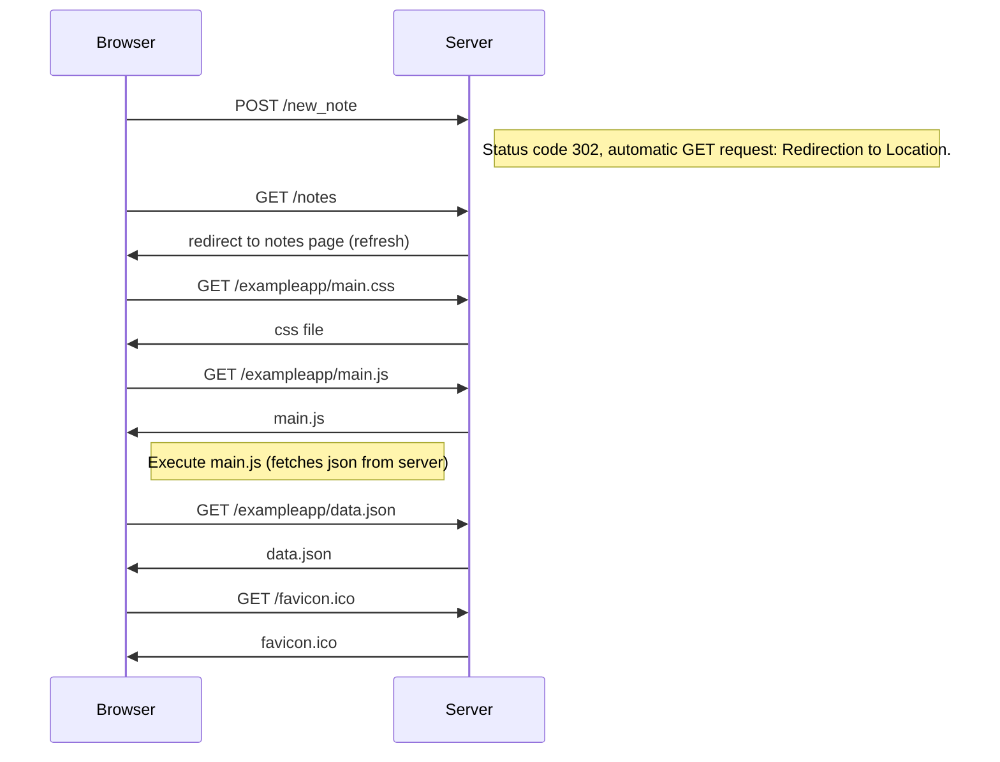

```mermaid
sequenceDiagram

participant Browser
participant Server
Browser ->> Server: POST /new_note
Note right of Server: Status code 302, automatic GET request: Redirection to Location.
Browser ->> Server: GET /notes
Server ->> Browser: redirect to notes page (refresh)
Browser ->> Server: GET /exampleapp/main.css
Server ->> Browser: css file
Browser ->> Server: GET /exampleapp/main.js
Server ->> Browser:  main.js
Note right of Browser: Execute main.js (fetches json from server)

Browser ->> Server: GET /exampleapp/data.json
Server ->> Browser: data.json
Browser ->> Server: GET /favicon.ico
Server ->> Browser: favicon.ico
```
